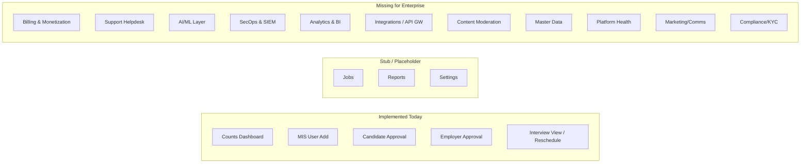

## 1. Current MIS State (Baseline)

The MIS module today (`src/app/mis/(dashboard)/`) ships with only the operational basics:

- Dashboard with 3 raw counts (candidates/companies/jobs) — see [src/app/mis/(dashboard)/dashboard/page.tsx](src/app/mis/(dashboard)/dashboard/page.tsx)
- MIS user management (add MIS users) — `users/`
- Candidate approval queue — `candidates/`
- Employer/company approval queue — `employers/`
- Interview oversight + reschedule — `interviews/`
- Sidebar placeholders for **Jobs**, **Reports**, **Settings** that are not implemented — see [src/components/mis/MISSidebar.tsx](src/components/mis/MISSidebar.tsx)

Underlying schema strengths in [prisma/schema.prisma](prisma/schema.prisma):

- Multi-round interviews, job offers, pipeline status, MIS reschedule columns are already modeled.
- `EventLog`, `ApiRequestLog`, `ErrorLog` tables exist but are not surfaced in the UI.
- A single flat `mis_user` model — **no internal RBAC**, no permission matrix, no MIS roles.

---

## 2. Industry Benchmark — What Enterprise Job Portals Have

Based on global standards (LinkedIn Recruiter, Indeed for Employers, SEEK, JobStreet, Glassdoor, Workday Recruiting, Bullhorn, Greenhouse), an enterprise MIS / Operator Console covers **16 domains**. JobGenie currently covers **~2 of 16** at production depth.

---

## 3. Feature Gap Analysis & Recommendations (16 Domains)

### Domain 1 — Identity, Access & Governance (CRITICAL GAP)
Currently `MisUser` is a flat list — every MIS user has full power. Industry standard:
- Granular RBAC: roles like `super_admin`, `approval_officer`, `compliance_officer`, `support_agent`, `finance_admin`, `read_only_auditor`
- Permission matrix table (`mis_role`, `mis_permission`, `mis_role_permission`)
- Mandatory MFA/2FA (TOTP / WebAuthn) for all MIS logins
- Session management: force logout, "logged-in devices" view, idle timeout
- IP allowlisting per MIS user
- SSO (SAML 2.0 / OIDC) for enterprise admins
- Privileged Access Management (just-in-time elevation, approval-to-elevate)
- Delegated admin & "view as user" with full audit trail

### Domain 2 — Audit, Compliance & Data Privacy
The `event_logs`, `api_request_logs`, `error_logs` tables exist but have **no MIS UI**. Missing:
- Audit log viewer with filters (who/what/when/IP/resource)
- Immutable/append-only audit storage with hash chain
- GDPR / PDPA / DPDP toolkit: data export per user, right-to-be-forgotten workflow, consent log
- Data Subject Access Request (DSAR) queue
- Configurable data retention policies (auto-purge after N days)
- Compliance reporting (SOC 2, ISO 27001 evidence packs)
- AML / sanctions screening (OFAC, UN, EU lists) for employers

### Domain 3 — KYC / KYB & Trust (HIGH PRIORITY)
Current verification is manual approval of BR certificate uploads. Missing:
- Automated BR certificate verification via govt API (Sri Lanka ROC integration is already drafted in `actions/verify-br-certificate.ts`)
- NIC / Passport OCR + face match (candidate)
- Document expiry watcher (BR cert, certifications) with auto-renewal nudges
- Profile authenticity score (AI/ML)
- Duplicate-account fraud detection (same NIC, same phone, same email pattern)
- Reference check workflow
- Background check provider integration (Sterling, Checkr equivalent)
- Trust badge / verified employer badge management

### Domain 4 — Content Moderation
No moderation tooling exists. Missing:
- Job posting moderation queue (pre-publish review)
- AI scam/fraud job detection (MLM, advance-fee scams)
- User-generated report queue: candidate reports employer, vice versa
- Banned words / regex-based content scanning
- Image moderation (NSFW, logos infringement) for company logos & profile pics
- Profile content review (professional summary, project descriptions)
- Strike system & graduated penalties
- Appeals workflow

### Domain 5 — Customer Support & Helpdesk
No ticketing exists. Missing:
- Integrated ticketing (or Zendesk/Freshdesk connector)
- Live chat console with Supabase Realtime
- Macros / canned replies
- SLA tracking & escalation
- Dispute resolution between candidate ↔ employer (e.g., "interview no-show" claims)
- Knowledge base / FAQ CMS
- Email template manager (today emails are code-defined in `lib/email/`)
- In-app notification center (currently only toast notifications)

### Domain 6 — Analytics, Reporting & BI (HIGH PRIORITY)
The dashboard shows raw counts only. Industry standard:
- Real-time KPI tiles: DAU/MAU, signup-to-active conversion, time-to-fill, time-to-hire
- Funnel: Signup → Profile complete → Approval → Application → Interview → Offer → Hire
- Cohort retention (signup month vs. activity)
- Industry-wise analytics (IT vs Banking vs Finance — your schema already supports this)
- Geographic heatmaps (`country` field already present on Candidate)
- Job-board health: avg applicants/job, expired-without-fill ratio
- Source attribution (UTM / referrer)
- Scheduled report subscriptions (email weekly PDF/CSV)
- Embedded BI (Metabase / Superset / Power BI) with row-level security
- Anomaly detection (sudden drop in approvals, spike in cancellations)
- Custom report builder (drag-drop column / filter / chart)

### Domain 7 — Monetization, Billing & Subscriptions (COMPLETELY MISSING — REVENUE BLOCKER)
There is **zero billing infrastructure**. For an enterprise job portal this is the biggest gap. Required:
- Subscription plans per employer (Free / Pro / Enterprise)
- Job-credit system (X postings / month)
- Featured / boosted job postings (paid promotion)
- Resume database tier (paid contact unlock)
- Payment gateway integration: Stripe + PayHere/WebXPay (Sri Lanka local)
- Invoice generation (PDF, sequential numbers, tax compliance)
- VAT / GST / WHT handling
- Promo codes, coupons, discount engine
- Wallet / credits ledger
- Dunning management (failed-payment retries)
- Refund workflow with approval
- Subscription analytics: MRR, ARR, churn, LTV, CAC
- Tax reporting export (for accounting)
- Multi-currency support

### Domain 8 — Marketing, Comms & Engagement
Missing platform-wide communication tooling:
- Email campaign builder + segmented mailing lists
- SMS gateway (interview reminders — high impact in SL market: Dialog, Mobitel, Hutch)
- WhatsApp Business API integration
- Push notification management (web push, mobile push when app launches)
- In-app announcement banner CMS
- A/B test framework (variant assignment + analytics)
- Referral program (referrer reward tracking)
- Job alert subscription engine (saved searches, daily digests)
- Re-engagement campaigns (dormant candidate nudges)

### Domain 9 — Master Data Management (MDM)
Currently industries, designations, seniority levels are seeded but **not MIS-editable**. Required:
- Industry taxonomy editor
- Skills taxonomy with synonyms & ESCO/O*NET alignment
- Job designation library editor (already has `JobDesignation` model)
- Geo master (country → city → suburb)
- Currency & FX rate master
- Verified educational institutions registry
- Verified professional certifications catalog (AWS, CFA, ACCA, CIMA, etc.)
- Company size / enterprise tier dictionary

### Domain 10 — AI / ML Capabilities (2026 Industry Standard)
You already use `@google/genai` for CV extract — extend to a full AI layer:
- Candidate ↔ Job matching score (vector embeddings via `pgvector`)
- AI job description generator + bias detection (DEI / inclusive language)
- Salary benchmark / market insights ("similar IT senior roles in SL pay 200k-280k")
- Interview question recommender per designation
- Career path recommendations for candidates
- Resume quality / completeness scorer with suggestions
- Predictive: employer churn risk, candidate ghosting risk, no-show probability
- Auto-translation (multi-language: Sinhala, Tamil, English)
- AI-assisted approval triage ("low risk – auto-approve" / "flag for human")
- Sentiment analysis on interview feedback (`outcome_notes`)

### Domain 11 — Platform Health & Operations
No system health monitoring exists in MIS. Required:
- System health dashboard (uptime, p95 latency, error rate)
- Background job / queue monitoring (depth, failures, retries)
- Storage utilization (Supabase Storage usage per bucket)
- Email deliverability dashboard (bounce, spam, open rate)
- Rate-limit / abuse monitoring per IP/user
- Feature flag manager (LaunchDarkly-style, can be self-built)
- Maintenance mode toggle (banner + read-only switch)
- Cache invalidation panel
- Cron / scheduled job manager (already have `pg_cron` ecosystem)
- API key issuance & quota dashboard (for partners)
- Webhook delivery monitor

### Domain 12 — Integrations & API Platform
For enterprise, partner integrations are key:
- Public REST + GraphQL API gateway with versioning
- API key & OAuth 2.0 client management
- Webhook subscription manager (employer/partner can subscribe to events)
- ATS connectors: Greenhouse, Lever, Workday, BambooHR
- HRIS integration (post-hire data sync)
- Calendar integration (Google Calendar / Outlook) for interview slots
- Video conferencing auto-link generation (Zoom, Teams, Meet) — currently `meeting_link` is manual
- Cross-posting to LinkedIn / Indeed / TopJobs / ikman
- Background check provider hooks
- DocuSign / e-signature for offer letters (your `JobOffer.offer_letter_url` is just a file)
- Accounting (QuickBooks, Xero) integration for billing

### Domain 13 — Advanced Recruitment Workflow
Your interview/offer schema is solid but UI/MIS oversight is thin. Missing:
- Skills assessment / coding test integration (HackerRank, Codility)
- Asynchronous video interview module
- Interview scorecard / rubric builder
- Talent pool / silver-medalist pipeline (CRM-style)
- Talent pipeline kanban view at MIS level
- Source-of-hire analytics
- Diversity & inclusion analytics dashboard
- Onboarding handoff workflow (after hire)
- Reference check module
- Salary negotiation tracker

### Domain 14 — Internal Workforce Management (for the MIS team itself)
Treat MIS staff as an internal team:
- Workload distribution: round-robin assignment of approval queues
- Performance metrics per MIS user (approvals/day, avg review time, accuracy)
- Shift / roster for 24×7 support
- Internal task assignment & comments on cases
- Quality assurance: random re-review of approvals
- Onboarding checklist for new MIS hires

### Domain 15 — Security Operations (SecOps)
- SIEM-style security event console (login anomalies, brute force, credential stuffing)
- Login activity per user (geo-IP)
- Session force-revoke
- IP block/allow lists with auto-temporary blocks
- WAF rule management
- Vulnerability scan & dependency CVE tracker
- Bug bounty triage console
- Incident response runbook (with timestamps, responders, post-mortems)

### Domain 16 — Data Lifecycle, DR & White-Label
- Automated backups + point-in-time restore UI
- Soft-delete / restore manager (your schema already has `deleted_at` on User)
- Data archival to cold storage
- DR / BCP runbook + last-test status
- Multi-tenant / white-label capability (sell to other portals as SaaS)
- Multi-region failover dashboard

---

## 4. Suggested Prioritization (90/180/365-Day Roadmap)

### Phase 1 — Foundation (0–90 days, MUST-HAVE)
1. **RBAC + MIS roles** (Domain 1) — block of every other admin feature
2. **2FA for MIS** (Domain 1) — security baseline
3. **Audit log viewer UI** (Domain 2) — `event_logs` table already exists, just needs UI
4. **Real reports module** (Domain 6) — replace placeholder `Reports` page with funnel + KPI tiles
5. **Email template manager** (Domain 5) — un-hardcode templates
6. **Master data editor** (Domain 9) — industries, designations, skills

### Phase 2 — Revenue & Trust (90–180 days)
7. **Billing & subscriptions** (Domain 7) — unlock monetization (Stripe + PayHere)
8. **Content moderation queue** (Domain 4) — pre-publish job moderation
9. **Support ticketing** (Domain 5)
10. **KYC/KYB automation** (Domain 3) — BR auto-verify, NIC OCR
11. **GDPR / PDPA toolkit** (Domain 2) — export, delete, consent
12. **Notification center + SMS** (Domain 8)

### Phase 3 — Differentiation (180–365 days)
13. **AI matching + JD generator** (Domain 10) — pgvector embeddings
14. **Public API + webhooks** (Domain 12) — opens partner ecosystem
15. **Calendar + video conferencing auto-link** (Domain 12)
16. **BI embedding + custom report builder** (Domain 6)
17. **A/B testing + campaigns** (Domain 8)
18. **SecOps console** (Domain 15)
19. **White-label / multi-tenant** (Domain 16) — productize as SaaS

---

## 5. Quick-Win Recommendations (≤ 1 sprint each)

These can be shipped rapidly using existing schema/infra:

- Surface `event_logs`, `api_request_logs`, `error_logs` in MIS — pure read-only UI on existing tables.
- Enrich `MisUser` with a `role` enum (`super_admin | approver | support | auditor`) — minimal migration.
- Real dashboard widgets: applicants/job, time-to-confirm interview, approval throughput per MIS user — all derivable from `JobInvitation`, `InterviewRound`, `Candidate.reviewed_by`.
- Bulk approve/reject + bulk export (CSV) in candidate & employer queues.
- Add `mfa_secret`, `last_login_ip` columns on `User` and gate MIS login on TOTP.
- Replace placeholder `Reports` page with a 6-card KPI overview using `prisma.$queryRaw` aggregates.

---

## 6. Architectural Notes for Enterprise Readiness

- **Tenancy**: Add `tenant_id` to every table now (even with single tenant) — retro-fitting later is painful.
- **Event-driven backbone**: Move side effects (emails, audit, notifications) to an outbox pattern + worker so MIS actions are atomic and observable.
- **Read replicas / CQRS for analytics**: Reporting queries should not hit the OLTP Supabase primary.
- **Object storage governance**: Lifecycle rules on `storage.ts` buckets; signed URLs with short TTL; antivirus scan on upload.
- **Internationalization (i18n)**: Wrap all strings now — Sinhala / Tamil markets are non-negotiable.
- **Observability**: Wire OpenTelemetry → Grafana / Datadog before scaling.
- **Service boundaries**: When the MIS module crosses ~30 entities, split into a separate Next.js app or NestJS service to isolate blast radius.
