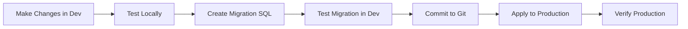

# Production Deployment Guide - RLS Migrations

## 🎯 Current Situation

You have **9 SQL migrations** that need to be applied to your **production Supabase database**:

1. `20260514_01_enable_rls.sql` - Initial RLS setup
2. `20260514_02_storage_rls.sql` - Storage bucket RLS
3. `20260514_03_fix_functions.sql` - Fixed mutable search_path
4. `20260514_04_fix_indexes.sql` - Dropped duplicate indexes
5. `20260514_05_revoke_password_column.sql` - Hid users.password column
6. `20260514_06_fix_remaining_rls.sql` - Added missing table policies
7. `20260514_07_drop_duplicate_idx_indexes.sql` - Cleaned up duplicate indexes
8. `20260514_08_fix_cross_table_rls.sql` - Added candidate cross-table read policies
9. `20260514_09_fix_interview_rounds_offers_rls.sql` - Added interview flow write policies

---

## 📋 Prerequisites

Before deploying to production:

1. ✅ Ensure all migrations work correctly in **dev environment**
2. ✅ Test all user flows (candidate, employer, MIS) in dev
3. ✅ Have a **database backup** of production (Supabase auto-backs up, but verify)
4. ✅ Schedule deployment during **low-traffic period** if possible
5. ✅ Have rollback plan ready (keep old SQL scripts)

---

## 🚀 Method 1: Supabase SQL Editor (Recommended for First Time)

### Step 1: Access Production Database

1. Go to [Supabase Dashboard](https://supabase.com/dashboard)
2. Select your **PRODUCTION** project
3. Navigate to **SQL Editor** (left sidebar)

### Step 2: Apply Migrations One by One

**IMPORTANT**: Apply migrations **in order** (01 → 09)

For each migration file:

1. Open the migration file locally: `supabase/migrations/20260514_01_enable_rls.sql`
2. Copy the **entire SQL content**
3. In Supabase SQL Editor:
   - Click **"New query"**
   - Paste the SQL
   - Click **"Run"** (Ctrl+Enter)
4. ✅ Verify success (check for error messages)
5. ⏭️ Move to next migration

**Example for migration 01:**
```sql
-- Copy and paste from: supabase/migrations/20260514_01_enable_rls.sql
-- Then click Run in SQL Editor
```

### Step 3: Verify Deployment

After applying all migrations:

```sql
-- 1. Check RLS is enabled on all tables
SELECT schemaname, tablename, rowsecurity 
FROM pg_tables 
WHERE schemaname = 'public' 
ORDER BY tablename;

-- 2. Check policies are created
SELECT tablename, COUNT(*) as policy_count
FROM pg_policies 
WHERE schemaname = 'public'
GROUP BY tablename
ORDER BY tablename;

-- 3. Verify SECURITY DEFINER functions are restricted
SELECT proname, proacl 
FROM pg_proc 
WHERE proname IN ('is_candidate', 'is_employer', 'is_mis_user') 
AND pronamespace = 'public'::regnamespace;
```

---

## 🔧 Method 2: Supabase CLI (Recommended for Future Updates)

### Setup (One-Time)

1. **Install Supabase CLI** (if not installed):
```powershell
# Windows (using Scoop)
scoop bucket add supabase https://github.com/supabase/scoop-bucket.git
scoop install supabase

# Or using npm
npm install -g supabase
```

2. **Link your project to Supabase CLI**:
```powershell
cd c:\Pathum\JG-Backup\JobGenie

# Link to production
supabase link --project-ref YOUR_PRODUCTION_PROJECT_REF
```

To find your `PROJECT_REF`:
- Go to Supabase Dashboard → Select Production Project
- Settings → General → Project Reference ID

3. **Login to Supabase**:
```powershell
supabase login
```

### Apply Migrations to Production

```powershell
# Push all migrations to production
supabase db push --linked

# Or apply specific migration
supabase db push --linked --include-all
```

### Verify Migrations

```powershell
# Check migration history on production
supabase migration list --linked

# Check current database status
supabase db diff --linked
```

---

## 🔄 Workflow for Future Dev → Production Sync

### Development Workflow



### Step-by-Step Process

#### 1. **Development Phase** (What you just did)

```powershell
# Work on dev database
# Test changes using Supabase MCP tools or SQL Editor (Dev)
# Create migration file: supabase/migrations/YYYYMMDD_XX_description.sql
```

#### 2. **Testing Phase**

```powershell
# Apply migration to dev database
# (You already did this via MCP apply_migration)

# Test your application thoroughly
npm run dev

# Test all user roles:
# - Candidate login → test invitations, rounds, offers
# - Employer login → test creating invitations, rounds, offers
# - MIS login → test admin features
```

#### 3. **Version Control**

```powershell
git add supabase/migrations/
git commit -m "feat: add RLS policies for interview flow"
git push origin main
```

#### 4. **Production Deployment**

**Option A: Using Supabase CLI** (After initial setup)
```powershell
# Push to production
supabase db push --linked
```

**Option B: Using SQL Editor** (Manual)
1. Copy migration SQL
2. Paste in Production SQL Editor
3. Run

#### 5. **Verification**

```powershell
# Check production logs
# Monitor error rates
# Test critical user flows in production
```

---

## 🛡️ Best Practices for Production Safety

### 1. **Always Use Transactions for Migrations**

Wrap migrations in transactions where possible:

```sql
BEGIN;

-- Your migration SQL here
ALTER TABLE ...
CREATE POLICY ...

-- Verify changes
SELECT * FROM pg_policies WHERE tablename = 'your_table';

COMMIT; -- Or ROLLBACK if something is wrong
```

### 2. **Test Migrations in Staging First**

**Ideal Setup**:
- **Dev Database**: For active development
- **Staging Database**: Mirror of production for final testing
- **Production Database**: Live user data

If you don't have staging, use dev as staging before production.

### 3. **Keep Migration History**

```
supabase/
├── migrations/
│   ├── 20260514_01_enable_rls.sql
│   ├── 20260514_02_storage_rls.sql
│   ├── ...
│   └── 20260514_09_fix_interview_rounds_offers_rls.sql
└── RLS_AUDIT_REPORT.md
```

**Never delete or modify** old migration files. Always create new ones.

### 4. **Document Each Migration**

Each migration file should have:
```sql
-- =====================================================
-- MIGRATION: 20260514_09_fix_interview_rounds_offers_rls
-- DESCRIPTION: Add write policies for interview rounds and job offers
-- AUTHOR: Dev Team
-- DATE: 2026-05-14
-- DEPENDENCIES: 20260514_08_fix_cross_table_rls.sql
-- ROLLBACK: See rollback_20260514_09.sql
-- =====================================================

-- Your SQL here
```

### 5. **Create Rollback Scripts**

For critical migrations, create rollback scripts:

```sql
-- rollback_20260514_09.sql
DROP POLICY IF EXISTS "Employers can create interview rounds" ON interview_rounds;
DROP POLICY IF EXISTS "Employers can update interview rounds" ON interview_rounds;
-- ... etc
```

---

## 🚨 Emergency Rollback Procedure

If production breaks after migration:

### Immediate Actions:

1. **Disable RLS temporarily** (if blocking all access):
```sql
-- Emergency: Disable RLS on specific table
ALTER TABLE interview_rounds DISABLE ROW LEVEL SECURITY;
```

2. **Revert to Admin Client** (already done in your code):
Your API routes use `createAdminClient()`, so they bypass RLS. If users report errors, the API should still work.

3. **Check Supabase Logs**:
- Dashboard → Logs → API Logs
- Look for RLS policy violations

4. **Apply Rollback Migration**:
```sql
-- Drop problematic policies
DROP POLICY IF EXISTS "policy_name" ON table_name;

-- Recreate old policy
CREATE POLICY "old_policy_name" ...
```

---

## 🎯 Quick Deployment Checklist

For applying **current 9 migrations** to production:

- [ ] Backup production database (Supabase auto-backs up daily)
- [ ] Open Supabase Dashboard → Production Project → SQL Editor
- [ ] Apply migration 01: `20260514_01_enable_rls.sql` → Run → Verify
- [ ] Apply migration 02: `20260514_02_storage_rls.sql` → Run → Verify
- [ ] Apply migration 03: `20260514_03_fix_functions.sql` → Run → Verify
- [ ] Apply migration 04: `20260514_04_fix_indexes.sql` → Run → Verify
- [ ] Apply migration 05: `20260514_05_revoke_password_column.sql` → Run → Verify
- [ ] Apply migration 06: `20260514_06_fix_remaining_rls.sql` → Run → Verify
- [ ] Apply migration 07: `20260514_07_drop_duplicate_idx_indexes.sql` → Run → Verify
- [ ] Apply migration 08: `20260514_08_fix_cross_table_rls.sql` → Run → Verify
- [ ] Apply migration 09: `20260514_09_fix_interview_rounds_offers_rls.sql` → Run → Verify
- [ ] Run verification queries (see "Step 3: Verify Deployment" above)
- [ ] Test production app: Candidate flow, Employer flow, MIS flow
- [ ] Monitor logs for 1-2 hours
- [ ] ✅ Deployment complete!

---

## 📞 Support Resources

- **Supabase CLI Docs**: https://supabase.com/docs/guides/cli
- **Migration Guide**: https://supabase.com/docs/guides/cli/local-development#database-migrations
- **RLS Documentation**: https://supabase.com/docs/guides/database/postgres/row-level-security

---

## 💡 Pro Tips

1. **Use environment-specific connection strings**:
   - Dev: `NEXT_PUBLIC_SUPABASE_URL` → Dev Supabase project
   - Prod: `NEXT_PUBLIC_SUPABASE_URL` → Production Supabase project

2. **Supabase projects are isolated**: Dev and prod are completely separate databases. Changes in dev don't affect prod until you manually apply them.

3. **Migration naming convention**:
   ```
   YYYYMMDD_NN_description.sql
   20260514_01_enable_rls.sql
   └─┬───┘ └┬┘ └────┬────────┘
     │      │       └─ Short description
     │      └─────────── Sequential number (01-99)
     └────────────────── Date (for ordering)
   ```

4. **Test on a clone first**: You can create a duplicate/clone of production in Supabase (Settings → General → Duplicate project) for safe testing.

---

**Next Steps**: Once migrations are applied to production, proceed with Phase 2 of the Enterprise Migration Plan (Auth Dashboard settings, Environment config).
